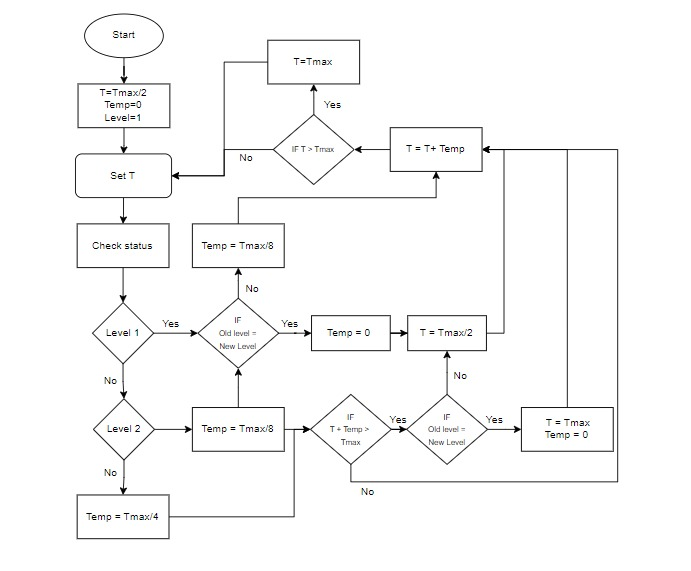
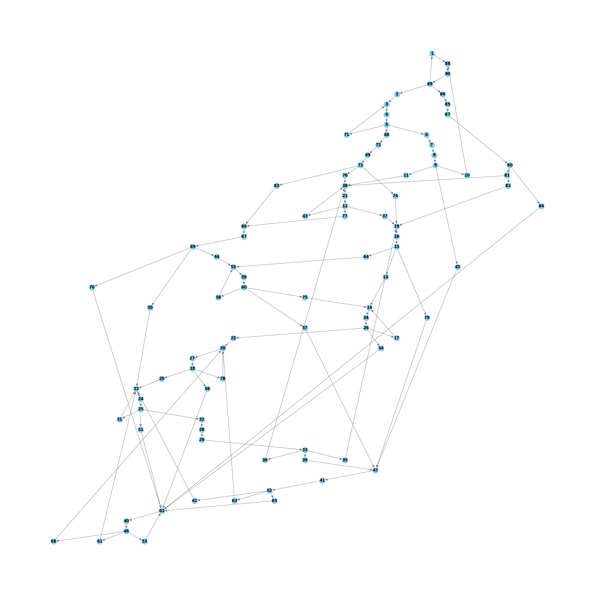

# Petri Net-Based Verification of Adaptive Traffic Light Control with AIMD Algorithm

## Overview

This repository contains the code written in the research paper titled "Petri Net-Based Verification of Adaptive Traffic Light Control with AIMD Algorithm." This repository also contains high definition pictures of the Petri Net and the Reachability Graph which could not be shown properly in the paper due to space constraints. It also contains the hash table which maps each marking to its integer equivalent as specified in the paper.

For those interested in running the code to observe the results firsthand, detailed instructions can be found in the 'Usage' section below.


## Abstract

The paper analyses the performance of the petri
net model created to simulate a traffic control system using the
Additive Increase Multiplicative Decrease (AIMD) algorithm. The
petri net model was designed using TimeNET tool. The model
was evaluated by analysing the Reachability Graph generated by
a Depth First Search (DFS) and Backtracking based algorithm.
Several criteria such as Stability, Boundedness, Deadlock, etc.
were verified by our proposed algorithm. The model was then
validated through a C++ code to ensure it performs correctly
under different situations.

## Table of Contents

1. [AIMD Algorithm](#aimd-algorithm)
2. [Petri Net Model](#petri-net-model)
3. [Reachability Graph](#reachability-graph)
4. [Marking Table](#marking-table)
5. [Usage](#usage)

## AIMD Algorithm

The Adaptive Increase Multiplicative Decrease (AIMD) algorithm is employed in this research as an adaptive traffic control mechanism as proposed by . The algorithm operates as follows:

1. **Cycle Length Adjustment:** The cycle length (T) dynamically adjusts based on the congestion level experienced by the intersection.

2. **No Congestion (Level-1):** When there is no congestion (Level-1), the algorithm suggests setting the cycle length to Tmax/2.

3. **Congestion Worsens (Level-2 or Worse):** As congestion worsens (Level-2 or worse), the cycle time increases by adding a value called "Temp" based on the congestion level. The value of "Temp" varies for different congestion levels. The value of temp is initially set as Tmax/8 for Level-2, Tmax/4 for Level-3, and 0 for Level-1, but may change as new traffic levels are experienced, in accordance with the AIMD algorithm.

4. **Additive Increase:** If congestion continues to increase, the algorithm keeps adding "Temp" to the cycle length until it reaches Tmax, representing an 'additive increase' in cycle time.

5. **Multiplicative Decrease:** When congestion decreases, a 'multiplicative decrease' occurs, and the cycle length is set to Tmax/2. It is then adjusted by "Temp" based on the congestion level.

6. **Iterative Monitoring:** This iterative process continually monitors and adjusts the cycle time based on congestion conditions.

For a visual representation of the algorithm, refer to the flowchart in the figure below. It can also be found in the folder `Paper` and by opening the `flowchart.jpeg`




## Petri Net Model

The Petri-net model as described in the paper is attached below. It can also be found in the folder `Paper` and by opening the `petrinet.pdf`. The XML code can be found in `petrinet.xml`


## Reachability Graph

The Reachability Graph associated with the Petri-Net is attached below.  It can also be found in the folder `Paper` and by opening the `reachabilitygraph.png`. 



Please be aware that when executing the code and examining the results, the mapping between markings and their integer equivalents is randomly generated by the code. Consequently, this mapping may vary each time the code is run. However, it is important to note that the underlying graph structure will remain consistent across different runs since the reachability graph is the same for the initial marking given.

## Marking Table

The marking table, which maps each marking to its corresponding integer values as specified in the paper, is provided below for the reachability graph attached above. It can also be found in the folder `Paper` and by opening the `markings.txt`. 

|      Marking        | Integer |
|---------------------|---------|
| 0000010000100000010 |    60   |
| 0000010000100000101 |    48   |
| 0000010000100001100 |    68   |
| 0000010001000000010 |    39   |
| 0000010001000000101 |    66   |
| 0000010001000010100 |    65   |
| 0000010010000000010 |    53   |
| 0000010010000000101 |    72   |
| 0000010010000100100 |    76   |
| 0000010100000000010 |    84   |
| 0000010100000000101 |    86   |
| 0000010100001000100 |    87   |
| 0000011000000000010 |    73   |
| 0000011000000000101 |    62   |
| 0000011000010000100 |    75   |
| 0000100000100000010 |    14   |
| 0000100000100000101 |    23   |
| 0000100000100001100 |    36   |
| 0000100001000000010 |    51   |
| 0000100001000000101 |    71   |
| 0000100001000010100 |    70   |
| 0000100010000000010 |    37   |
| 0000100010000000101 |    33   |
| 0000100010000100100 |    29   |
| 0000100100000000010 |    24   |
| 0000100100000000101 |    25   |
| 0000100100001000100 |    18   |
| 0000101000000000010 |     4   |
| 0000101000000000101 |     5   |
| 0000101000010000100 |     3   |
| 0001000000100000010 |    15   |
| 0001000000100000101 |    12   |
| 0001000000100001100 |    27   |
| 0001000001000000010 |    21   |
| 0001000001000000101 |    32   |
| 0001000001000010100 |    22   |
| 0001000010000000010 |    31   |
| 0001000010000000101 |    30   |
| 0001000010000100100 |    16   |
| 0001000100000000010 |     8   |
| 0001000100000000101 |     9   |
| 0001000100001000100 |     7   |
| 0001001000000000010 |    90   |
| 0001001000000000101 |    89   |
| 0001001000010000100 |    88   |
| 0010010000100000100 |    57   |
| 0010010001000000100 |    40   |
| 0010010010000000100 |    58   |
| 0010010100000000100 |    80   |
| 0010011000000000100 |    83   |
| 0010100000100000100 |    52   |
| 0010100001000000100 |    46   |
| 0010100010000000100 |    63   |
| 0010100100000000100 |    47   |
| 0010101000000000100 |    43   |
| 0011000000100000100 |    42   |
| 0011000001000000100 |    50   |
| 0011000010000000100 |    64   |
| 0011000100000000100 |    59   |
| 0011001000000000100 |    82   |
| 0100010000100000100 |    49   |
| 0100010001000000100 |    67   |
| 0100010010000000100 |    77   |
| 0100010100000000100 |    81   |
| 0100011000000000100 |    45   |
| 0100100000100000100 |    69   |
| 0100100001000000100 |    61   |
| 0100100010000000100 |    74   |
| 0100100100000000100 |    28   |
| 0100101000000000100 |    79   |
| 0101000000100000100 |    17   |
| 0101000001000000100 |    38   |
| 0101000010000000100 |    41   |
| 0101000100000000100 |    11   |
| 0101001000000000100 |     2   |
| 1000010000100000100 |    56   |
| 1000010001000000100 |    54   |
| 1000010010000000100 |    78   |
| 1000010100000000100 |    85   |
| 1000011000000000100 |    44   |
| 1000100000100000100 |    35   |
| 1000100001000000100 |    55   |
| 1000100010000000100 |    19   |
| 1000100100000000100 |    26   |
| 1000101000000000100 |     6   |
| 1001000000100000100 |    13   |
| 1001000001000000100 |    34   |
| 1001000010000000100 |    20   |
| 1001000100000000100 |    10   |
| 1001001000000000100 |     1   |


## Usage

Before running the code, ensure that you have the following prerequisites installed:

### C++ Compiler

### Python Compiler

### Python Libraries

You'll need the `networkx` and `matplotlib` libraries for running the Python code. Install them using the following commands:

```bash
pip install networkx
pip install matplotlib

```

Once you have the prerequisites installed, you can proceed by following the steps given below:

### 1. Clone the Repository

Clone the repository to your local machine by using the following command on Command Prompt:

```bash
git clone https://github.com/sachinprasanna7/Petri-Net-Based-Verification-of-Adaptive-Traffic-Light-Control-with-AIMD-Algorithm.git
```

### 2. Navigate to the Project Directory

Navigate to the directory where you cloned the repository by using the following command in the Command Prompt:

```bash
cd your-repository
```

Replace `your-repository` with the absolute path to the location where the repository is stored on your local machine.

### 3. Run the Batch Executable

Type the following command in on Command Prompt to observe all the results at once:

```bash
run_program.bat
```


